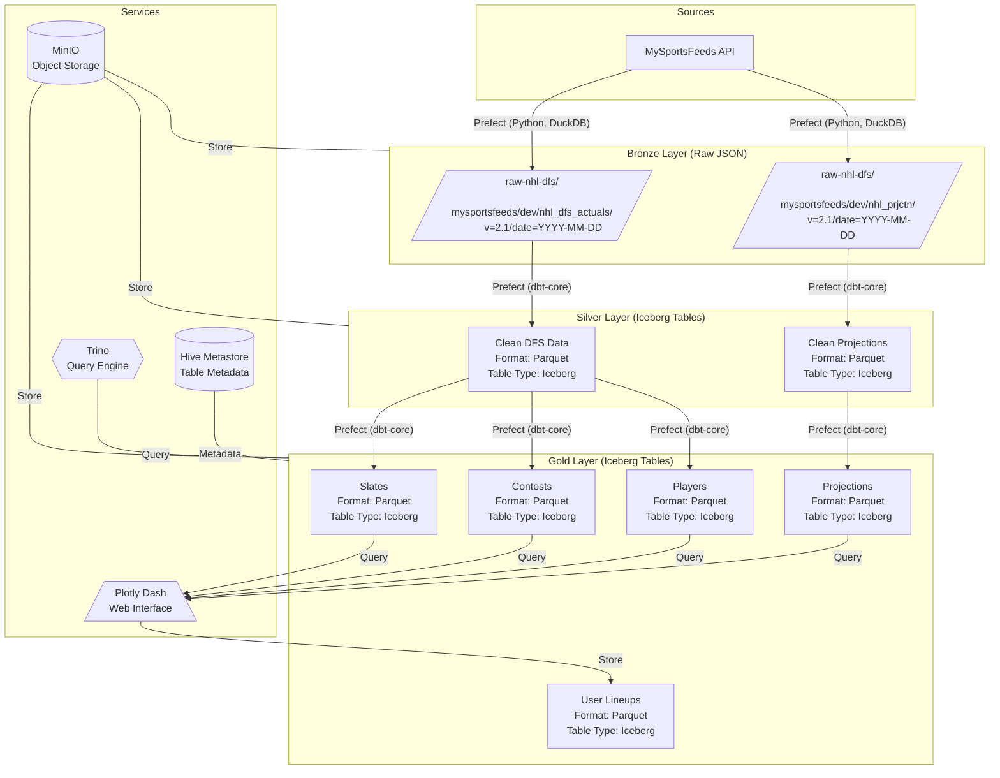

# BlueLine

NHL daily fantasy sports optimizer. Built in tandem with Claude Projects (3.5 Sonnet) 

# Architecture - Process View
 

```mermaid

flowchart TB
    subgraph Sources
        MSF[MySportsFeeds API]
    end

    subgraph Bronze["Bronze Layer (Raw JSON)"]
        direction TB
        RAW_DFS[/"raw-nhl-dfs/
        mysportsfeeds/dev/nhl_dfs_actuals/
        v=2.1/date=YYYY-MM-DD"/]
        RAW_PROJ[/"raw-nhl-dfs/
        mysportsfeeds/dev/nhl_prjctn/
        v=2.1/date=YYYY-MM-DD"/]
    end

    subgraph Silver["Silver Layer (Iceberg Tables)"]
        direction TB
        CLEAN_DFS["Clean DFS Data
        Format: Parquet
        Table Type: Iceberg"]
        CLEAN_PROJ["Clean Projections
        Format: Parquet
        Table Type: Iceberg"]
    end

    subgraph Gold["Gold Layer (Iceberg Tables)"]
        direction TB
        SLATES["Slates
        Format: Parquet
        Table Type: Iceberg"]
        CONTESTS["Contests
        Format: Parquet
        Table Type: Iceberg"]
        PLAYERS["Players
        Format: Parquet
        Table Type: Iceberg"]
        PROJECTIONS["Projections
        Format: Parquet
        Table Type: Iceberg"]
        LINEUPS["User Lineups
        Format: Parquet
        Table Type: Iceberg"]
    end

    subgraph Services
        MINIO[(MinIO
        Object Storage)]
        TRINO{{Trino
        Query Engine}}
        HIVE[(Hive Metastore
        Table Metadata)]
        DASH[/Plotly Dash
        Web Interface\]
    end

    MSF --> |"Prefect (Python, DuckDB)"| RAW_DFS
    MSF --> |"Prefect (Python, DuckDB)"| RAW_PROJ

    RAW_DFS --> |"Prefect (dbt-core)"| CLEAN_DFS
    RAW_PROJ --> |"Prefect (dbt-core)"| CLEAN_PROJ

    CLEAN_DFS --> |"Prefect (dbt-core)"| SLATES
    CLEAN_DFS --> |"Prefect (dbt-core)"| CONTESTS
    CLEAN_DFS --> |"Prefect (dbt-core)"| PLAYERS
    CLEAN_PROJ --> |"Prefect (dbt-core)"| PROJECTIONS
    
    SLATES --> |Query| DASH
    CONTESTS --> |Query| DASH
    PLAYERS --> |Query| DASH
    PROJECTIONS --> |Query| DASH
    DASH --> |Store| LINEUPS

    MINIO --- |Store| Bronze
    MINIO --- |Store| Silver
    MINIO --- |Store| Gold
    TRINO --- |Query| Gold
    HIVE --- |Metadata| Gold

```