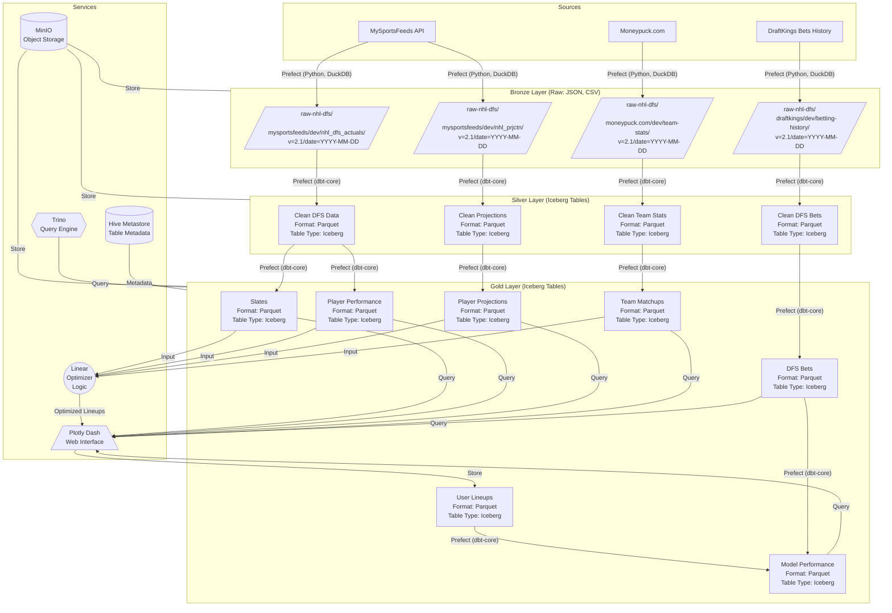

# 4 + 1 Architecture

Inspired by Chapter 8, "Breaking Changes", in Marianne Belotti's book, KILL IT WITH FIRE
https://en.wikipedia.org/wiki/4%2B1_architectural_view_model

## Logical View

The logical view focuses on functionality that the system provides the end-user

1. USER: User interacts with a plotly dash landing webpage, and has the option to select a dropdown filter of "slates" for today's date, and other options that can constrain the optimizer's teams and players to choose from. Choices are submitted through a form request.
2. PROCESSING: the request is sent to backend for query processing. Players for that slate are selected, along with their data (teams, position, DFS salary, predictions)
3. SERVING
 - the request results are served back to plotly dash in the form of a python dataframe, availabe in the UI
 - a toggle can be adjusted by the user to set the number of lineups we want the optimizer to generate. The user sets and clicks this number
 - the linear optimizer runs and generates proposed lineups that maximize predicted points, under constraints
 - the lineup results are shown in the page to manually use to input into DraftKings UI
 - if the user uses any of these lineups, they can select that lineup, and it gets recorded in the database as a chosen lineup.
 
## Process View

The process view focuses on what the system does and why

1. CLI: used to control the entire infrastructure
2. Docker Host: initialized and controlled by a remote CLI, which will implement the docker-compose.yml and docker network of services in this data lakehouse and dash app
3. Batch data ingestion: 
 - this happens at least once per day via Prefect, but could be orchestrated intraday to get the latest data feeds from data sources, which will be relied upon by the user when interacting with the app
 - ETL jobs orchestrated with store raw data as JSON, transform them to parquet files, model them as iceberg tables, and be made available for query operations in support of the user's application needs

## Development View

The development view is the architecture from the lens of how the developer sees it. For me, this will largely be a result of the work Claude helps me to stub out.

1. docker-compose.yml
2. scripts/ directory for all batch ingestion related code
3. dash/ directory for all plotly dash webapp related code
4. database/, dbt/, iceberg/ directories possibly to house code relating to physical implementation of database objects in trino

## Physical View

The physical view represents the architecture across physical hardware. I will omit this one and defer to the masterplan.md's technology stack details, as this is not a major focus right now