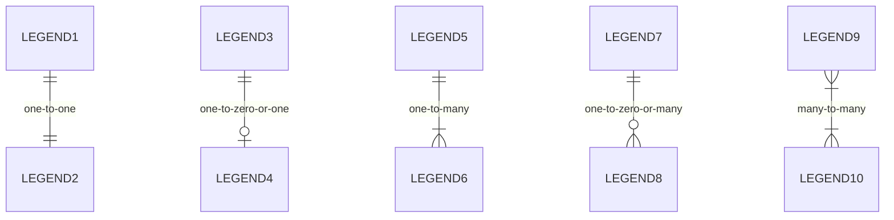
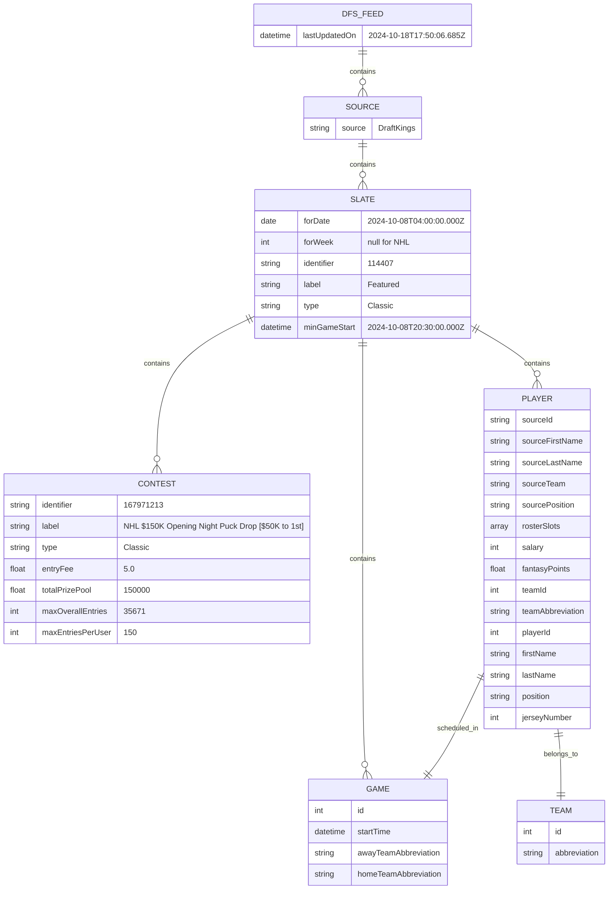
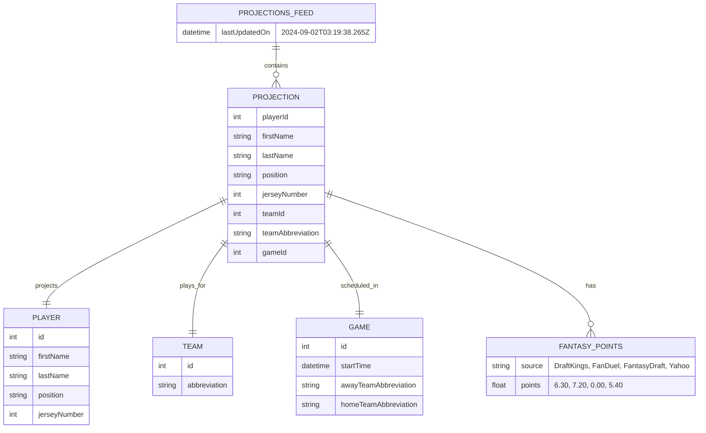

# Data Model Diagrams

## Legend
Crows feet notation for ERDs

## Sources

### MySportsFeeds API

#### Daily DFS Endpoint
This endpoint is consumed as JSON

#### DFS Projections Endpoint
This endpoint is consumed as JSON

